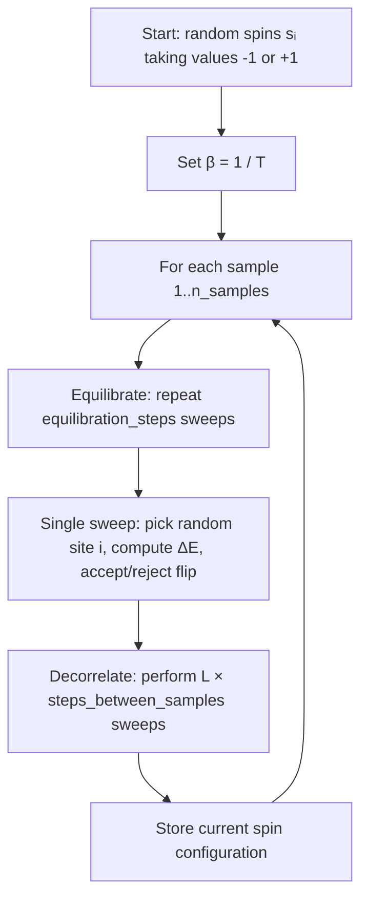
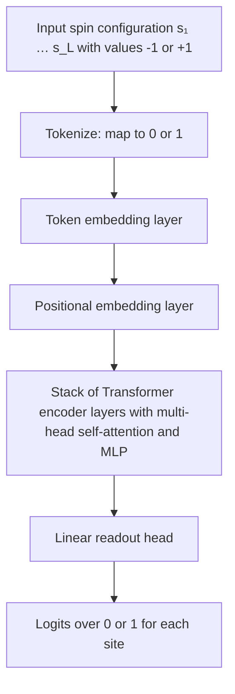
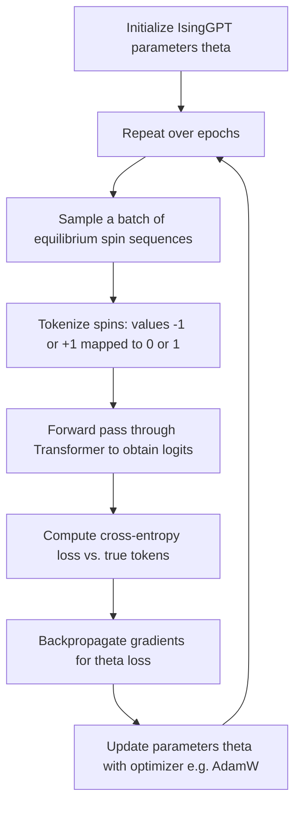

# Chapter 01: IsingGPT – Transformer Learns Phase Transitions

> A minimal 2-layer Transformer trained on equilibrium samples from the 1D Ising model spontaneously discovers the Boltzmann distribution, nearest-neighbor spin correlations, and phase-transition behavior — without ever seeing the Hamiltonian. Kudos to Andrej Karpathy's, this chapter is inspired by his nanoGPT (https://github.com/karpathy/nanoGPT).
 
---

## Physics Background

### The 1D Ising Model

The Ising model is the "hydrogen atom" of statistical mechanics: simple enough to solve analytically, rich enough to exhibit nontrivial collective behavior.

**Hamiltonian**:

$$
H[\{s_i\}] = -J \sum_{i=1}^{L} s_i s_{i+1} - h \sum_{i=1}^{L} s_i
$$

where:
- $s_i \in \{-1, +1\}$: spin at site $i$ (periodic boundary: $s_{L+1} = s_1$)
- $J > 0$: ferromagnetic coupling (prefers alignment $\uparrow\uparrow$)
- $h$: external magnetic field
- $L$: chain length

**Boltzmann distribution** at temperature $T$:

$$
p_T(\{s_i\}) = \frac{1}{Z(T)} \exp\Big(-\frac{H[\{s_i\}]}{k_B T}\Big)
$$

where $Z(T) = \sum_{\{s_i\}} \exp(-H/k_B T)$ is the partition function.

### Phase Transition (in infinite 1D: none; but crossover exists)

In 1D with finite $L$, there is no true phase transition, but:
- **High $T$ (paramagnetic)**: spins are disordered, $\langle s_i s_j \rangle \to 0$ rapidly
- **Low $T$ (ordered)**: spins align, $\langle s_i s_j \rangle \approx 1$ for all $i, j$

**Key observable: two-point correlation function**

$$
C(r) = \langle s_i s_{i+r} \rangle - \langle s_i \rangle^2
$$

At $h=0$ (zero field), this decays as

$$
C(r) \sim e^{-r/\xi(T)}
$$

where $\xi(T) = -1/\log(\tanh(J/k_B T))$ is the **correlation length**. As $T \to 0$, $\xi \to \infty$ (quasi-long-range order).

To illustrate the phase diagram, we generate samples across a grid of temperatures $T$ and fields $h$, verifying that observables like magnetization transition smoothly between ordered (low $T$, small $h$) and disordered (high $T$) regimes:

---

## Algorithm: Metropolis-Hastings Sampling

We generate equilibrium samples from $p_T(\{s_i\})$ using the **Metropolis algorithm**:

1. Initialize spins randomly: $s_i \in \{-1, +1\}$
2. **Sweep** (repeat $L$ times):
   - Pick a random site $i$
   - Compute energy change if we flip $s_i \to -s_i$:
     $$
     \Delta E = 2 J s_i (s_{i-1} + s_{i+1}) + 2 h s_i
     $$
   - Accept flip with probability:
     $$
     \min\Big(1, \exp\big(-\Delta E / k_B T\big)\Big)
     $$
3. After equilibration (500–1000 sweeps), save configuration
4. Wait 10–20 sweeps between samples (decorrelation)

**Implementation sketch** (`src/ising.py`), as a flowchart:

---

## ML Narrative: Transformer as Boltzmann Distribution Learner

### Setup

We treat each spin configuration $\{s_1, \dots, s_L\}$ as a **sequence** and train a standard autoregressive Transformer:

$$
p_\theta(s_1, \dots, s_L) = \prod_{i=1}^{L} p_\theta(s_i \mid s_{1:i-1})
$$

**Training objective**: maximum likelihood over equilibrium samples

$$
\max_\theta \; \mathbb{E}_{\text{samples}} \Big[\log p_\theta(s_1, \dots, s_L)\Big]
$$

If the model has enough capacity and training converges, then:

$$
p_\theta(\{s_i\}) \approx p_T(\{s_i\}) = \frac{1}{Z(T)} \exp\Big(-\frac{H[\{s_i\}]}{k_B T}\Big)
$$

**Key insight**: The Transformer never sees $J$, $h$, or $T$. It only sees raw samples. Yet it learns to **implicitly encode the Boltzmann distribution** and the underlying energy landscape.

The training process, using a standard autoregressive objective, shows a smooth convergence as the model internalizes the underlying physics:

### Architecture: IsingGPT

**Training loop (conceptual)**:

### What the Model Learns

After training, we observe:

1. **Accurate Boltzmann distribution**: Sampled configurations from $p_\theta$ match those from Metropolis
2. **Attention = Correlation function**: The attention weights $\alpha_{ij}$ in layer 1 spontaneously approximate the two-point correlation $C(|i-j|)$
3. **Phase-transition tracking**: Models trained at different $T$ exhibit systematically different attention patterns

Evaluating the trained model across the $(h, T)$ grid reveals robust performance, with degradation near critical points where distributions are more complex:

**Visualization**: Plot attention matrix $A_{ij} = \alpha_{ij}$ vs. theoretical correlation $C(|i-j|)$. They align remarkably well.

---

## Connection to Statistical Physics

### Why does this work?

The autoregressive factorization

$$
p_\theta(s_1, \dots, s_L) = \prod_{i=1}^{L} p_\theta(s_i \mid s_{1:i-1})
$$

is **universal**: any distribution over sequences can be written this way. But the Ising model has a special property: it's a **Markov random field** with nearest-neighbor interactions.

The Transformer's **attention mechanism** naturally discovers this locality:
- At low $T$, spins are strongly correlated → attention focuses on neighbors
- At high $T$, correlations decay fast → attention is more diffuse

In other words:
- **Physics**: $p_T(\{s_i\}) \propto \exp(-H/k_B T)$, where $H$ encodes nearest-neighbor coupling
- **ML**: $p_\theta(\{s_i\})$ learned via attention, which discovers the same coupling structure

The Transformer **doesn't know about Hamiltonians**, but by maximizing likelihood on equilibrium samples, it reverse-engineers the energy landscape.

### Attention as a Boltzmann weight

At each position $i$, the attention score over past spins $s_j$ ($j < i$) can be written:

$$
\alpha_{ij} = \frac{\exp(q_i \cdot k_j / \sqrt{d})}{\sum_{j'<i} \exp(q_i \cdot k_{j'} / \sqrt{d})}
$$

This is exactly a **local Boltzmann distribution** over indices $j$, where:
- "energy" $\approx -q_i \cdot k_j$
- "temperature" $\approx \sqrt{d}$

In the Ising model, the relevant information for predicting $s_i$ is $s_{i-1}$ (and to a lesser extent $s_{i-2}, s_{i-3}, \dots$). The attention mechanism automatically **up-weights nearby spins** because they carry higher mutual information.

Empirically, the learned attention weights mirror the theoretical spin-spin correlations, providing direct evidence for this physics-ML connection:

---

## Key Takeaways

1. **Transformers as implicit Boltzmann machines**: By training on equilibrium samples, the model learns the underlying energy landscape without ever seeing the Hamiltonian.

2. **Attention ≈ Correlation**: The learned attention weights naturally mirror the spin-spin correlation function — a purely emergent phenomenon.

3. **Statistical physics ↔ ML**: The Ising model is a pedagogical bridge. In more complex systems (language, images, RL), the same principle holds: **maximum likelihood on data ≈ learning the Boltzmann distribution of an unknown energy function**.

4. **Phase transitions in neural networks**: The model's internal representations (attention patterns, layer activations) change qualitatively as you vary the data-generating distribution's "temperature". This suggests a deep connection between phase transitions in physics and critical phenomena in deep learning.

---

## Further Reading

- **Physics**: Kardar, *Statistical Physics of Particles* (Chapter 3: Ising Model)
- **ML**: Graves, *Generating Sequences With Recurrent Neural Networks*
- **Connection**: Mehta et al., *A high-bias, low-variance introduction to Machine Learning for physicists* (arXiv:1803.08823)

