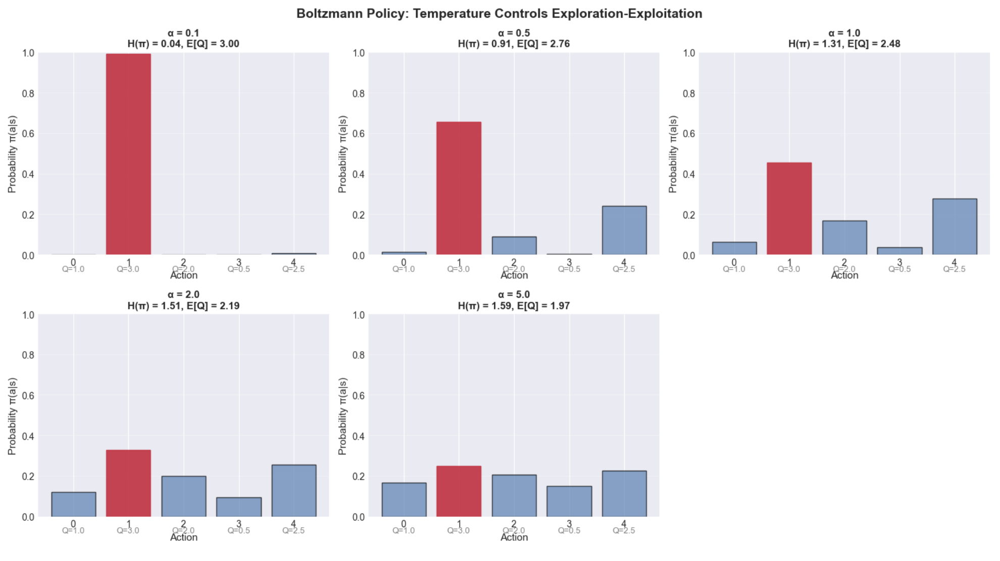

> Soft Actor-Critic (SAC) and maximum-entropy reinforcement learning are not ad-hoc tricks — they are the **unique, principled solution** to control under uncertainty, derived from Langevin dynamics and Jaynes' maximum caliber principle.

---

## Physics Background

### Langevin Dynamics

Consider a particle moving in a potential $V(x)$ at temperature $T$, subject to **overdamped** (high-friction) dynamics:

$$
\dot{x} = -\nabla V(x) + \sqrt{2 D} \, \eta(t)
$$

where:
- $\nabla V(x)$: deterministic force (gradient descent on potential)
- $\eta(t)$: white noise, $\langle \eta(t) \eta(t') \rangle = \delta(t - t')$
- $D = k_B T / \gamma$: diffusion coefficient (Einstein relation), where $\gamma$ is friction

**Key result**: The stationary distribution is the **Boltzmann distribution**:

$$
p_{\text{eq}}(x) = \frac{1}{Z} \exp\Big(-\frac{V(x)}{k_B T}\Big)
$$

where $Z = \int dx \, \exp(-V(x)/k_B T)$.

**Interpretation**: The system **explores the energy landscape** via thermal fluctuations, but spends exponentially more time in low-energy regions. The temperature $T$ controls the exploration-exploitation tradeoff:
- High $T$: wide exploration (flat distribution)
- Low $T$: exploitation (concentrate at global minimum)

### Fokker-Planck Equation

The evolution of the probability density $p(x, t)$ under Langevin dynamics is governed by the **Fokker-Planck equation**:

$$
\frac{\partial p}{\partial t} = \nabla \cdot \Big[\nabla V(x) \, p + D \, \nabla p\Big]
$$

At equilibrium ($\partial p / \partial t = 0$), this yields the Boltzmann distribution.

The figure below shows Langevin dynamics in a double-well potential at different temperatures. The empirical histograms (blue) match the theoretical Boltzmann distribution (red), confirming that temperature controls the exploration-exploitation tradeoff.

**Key observations**:
- Low $T$ (0.1): Particle is trapped in one well (exploitation)
- High $T$ (2.0): Particle explores both wells (exploration)
- Empirical distributions converge to theoretical Boltzmann predictions

---

## Maximum Caliber: Entropy Over Paths

### Jaynes' Maximum Entropy Principle (Static)

Given constraints $\mathbb{E}_p[f_k(x)] = c_k$, the **least-biased** distribution is:

$$
p^*(x) = \arg\max_p H(p) = \arg\max_p \Big(-\int p(x) \log p(x) \, dx\Big)
$$

subject to the constraints. The solution is the **exponential family**:

$$
p^*(x) = \frac{1}{Z} \exp\Big(-\sum_k \lambda_k f_k(x)\Big)
$$

### Maximum Caliber (Dynamic)

For **trajectories** $x(t)$ over time $[0, T]$, we maximize entropy over **path distributions** $P[x(t)]$:

$$
P^*[x(t)] = \arg\max_P \mathcal{H}[P]
$$

subject to trajectory-level constraints, e.g.:

$$
\mathbb{E}_P\Big[\int_0^T L(x(t), \dot{x}(t)) \, dt\Big] = \bar{L}
$$

The solution (Jaynes, 1980) is:

$$
P^*[x(t)] \propto \exp\Big(-\int_0^T L(x(t), \dot{x}(t)) \, dt\Big)
$$

This is exactly the **path-integral weight** from statistical mechanics!

**In RL context**: Replace $L$ with negative reward $-R$, and maximize caliber subject to a constraint on expected cumulative reward. The result is a policy that **maximizes both reward and entropy**.

---

## Maximum-Entropy Reinforcement Learning

### Standard RL Objective

Find a policy $\pi(a|s)$ that maximizes expected return:

$$
J(\pi) = \mathbb{E}_{\tau \sim \pi} \Big[\sum_{t=0}^{T} \gamma^t r_t\Big]
$$

where $\tau = (s_0, a_0, r_0, s_1, a_1, r_1, \dots)$ is a trajectory sampled by following $\pi$.

**Problem**: This often leads to:
- **Brittle policies**: deterministic, overfit to specific environment dynamics
- **Poor exploration**: gets stuck in local optima
- **Lack of robustness**: fails under perturbations

### MaxEnt RL Objective

Add an **entropy regularization** term:

$$
J_{\text{MaxEnt}}(\pi) = \mathbb{E}_{\tau \sim \pi} \Big[\sum_{t=0}^{T} \gamma^t \big(r_t + \alpha H(\pi(\cdot | s_t))\big)\Big]
$$

where:
- $H(\pi(\cdot | s)) = -\sum_a \pi(a|s) \log \pi(a|s)$: entropy of the policy at state $s$
- $\alpha > 0$: temperature parameter (controls exploration)

**Intuition**: Among all policies achieving the same expected reward, prefer the **most random** one (maximum entropy). This ensures:
- **Exploration**: the policy doesn't collapse to a single action
- **Robustness**: spread probability mass over multiple good actions
- **Transfer learning**: learned skills are more general

### Connection to Langevin Dynamics

Rewrite the value function for MaxEnt RL:

$$
V^\pi(s) = \mathbb{E}_{\pi} \Big[\sum_{t=0}^{\infty} \gamma^t (r_t + \alpha H(\pi(\cdot | s_t))) \Big| s_0 = s\Big]
$$

Define a "free energy" (Helmholtz analogy):

$$
F^\pi(s) = -V^\pi(s) = -\mathbb{E}[R] - \alpha H(\pi)
$$

The optimal policy minimizes $F^\pi(s)$ — this is exactly the **variational principle** in statistical mechanics.

In continuous time, the policy update can be written as a **gradient flow**:

$$
\frac{\partial \pi}{\partial t} \propto -\nabla_\pi F(\pi) = \nabla_\pi \Big(\mathbb{E}_\pi[R] + \alpha H(\pi)\Big)
$$

This is **Langevin dynamics in policy space**, where:
- "Energy" $\leftrightarrow$ negative reward $-R$
- "Temperature" $\leftrightarrow$ entropy coefficient $\alpha$

---

## Algorithm: Soft Actor-Critic (SAC)

SAC (Haarnoja et al., 2018) is the **state-of-the-art** continuous-control algorithm based on MaxEnt RL.

### Soft Bellman Equation

Define the **soft Q-function**:

$$
Q^*(s, a) = r(s, a) + \gamma \, \mathbb{E}_{s' \sim p(\cdot|s,a)} \Big[V^*(s')\Big]
$$

where the **soft value function** is:

$$
V^*(s) = \mathbb{E}_{a \sim \pi^*(\cdot|s)} \Big[Q^*(s, a) - \alpha \log \pi^*(a|s)\Big]
$$

Equivalently:

$$
V^*(s) = \alpha \log \int \exp\Big(\frac{1}{\alpha} Q^*(s, a)\Big) da
$$

This is a **soft maximum** (LogSumExp). As $\alpha \to 0$, it reduces to the standard $V^*(s) = \max_a Q^*(s, a)$.

### Optimal Policy

The optimal policy in MaxEnt RL is:

$$
\pi^*(a|s) = \frac{1}{Z(s)} \exp\Big(\frac{1}{\alpha} Q^*(s, a)\Big)
$$

where $Z(s) = \int \exp(Q^*(s,a)/\alpha) da$ is the partition function.

**This is exactly the Boltzmann distribution** over actions, with:
- "Energy" $= -Q^*(s, a)$
- "Temperature" $= \alpha$

The figure below demonstrates how the temperature parameter $\alpha$ controls the policy distribution over actions with different Q-values:

**Key observations**:
- $\alpha \to 0$: Policy becomes deterministic (selects highest Q-value action, shown in red)
- $\alpha \to \infty$: Policy becomes uniform (maximum exploration)
- Intermediate $\alpha$: Balances exploitation (high Q-values) with exploration (entropy)
- Higher $\alpha$ leads to higher entropy $H(\pi)$ and more distributed probability mass

### SAC Algorithm

SAC maintains:
1. **Soft Q-networks**: $Q_\phi(s, a)$ (two networks for stability, take minimum)
2. **Policy network**: $\pi_\theta(a|s)$ (Gaussian for continuous actions)
3. **Target networks**: $Q_{\phi'}$ (slowly updated via Polyak averaging)

**Training loop**:

**1. Critic update** (minimize soft Bellman error):

$$
L_Q(\phi) = \mathbb{E}_{(s,a,r,s') \sim \mathcal{D}} \Big[\big(Q_\phi(s,a) - y\big)^2\Big]
$$

where the target is:

$$
y = r + \gamma \Big(\min_{i=1,2} Q_{\phi_i'}(s', a') - \alpha \log \pi_\theta(a'|s')\Big), \quad a' \sim \pi_\theta(\cdot | s')
$$

**2. Actor update** (maximize expected soft Q-value):

$$
L_\pi(\theta) = \mathbb{E}_{s \sim \mathcal{D}, a \sim \pi_\theta(\cdot|s)} \Big[\alpha \log \pi_\theta(a|s) - Q_\phi(s, a)\Big]
$$

This is equivalent to minimizing the KL divergence:

$$
\text{KL}\Big(\pi_\theta(\cdot|s) \,\Big\|\, \frac{1}{Z(s)} \exp\big(Q_\phi(s, \cdot)/\alpha\big)\Big)
$$

**3. Temperature auto-tuning** (optional):

Adjust $\alpha$ to maintain a target entropy $\bar{H}$:

$$
L_\alpha = -\mathbb{E}_{a \sim \pi_\theta} \Big[\alpha \big(\log \pi_\theta(a|s) + \bar{H}\big)\Big]
$$

---

## ML Narrative: Why MaxEnt Wins

### Comparison with Standard RL

| Standard RL | MaxEnt RL (SAC) |
|-------------|-----------------|
| Policy: deterministic or $\epsilon$-greedy | Policy: stochastic Boltzmann |
| Exploration: external (e.g., noise injection) | Exploration: intrinsic (entropy bonus) |
| Bellman equation: $Q(s,a) = r + \gamma \max_{a'} Q(s',a')$ | Soft Bellman: $Q(s,a) = r + \gamma \, \mathbb{E}[\text{softmax}_\alpha Q(s',\cdot)]$ |
| Overestimates value (max bias) | Less biased (soft max) |
| Brittle to environment changes | Robust (multi-modal policy) |

### Empirical Advantages

1. **Sample efficiency**: SAC matches or beats PPO/DDPG on most continuous-control benchmarks
2. **Stability**: Entropy regularization prevents policy collapse, smooths optimization
3. **Off-policy**: Can reuse old data (unlike on-policy methods like PPO)
4. **Automatic exploration**: No need to manually tune exploration noise

### Training Results on Pendulum-v1

The figure below shows SAC training on the continuous control task Pendulum-v1 (swing-up and balance):

**Key observations**:
- **Learning Curve** (left): Episode reward improves from ~-1500 (random) to ~-300, showing learning progress. The smoothed curve (dark blue) shows clear improvement despite high variance.
- **Exploration** (middle): Policy entropy decreases over time as the agent becomes more confident, but remains non-zero (maintains stochasticity). This is a key advantage of MaxEnt RL.
- **Training Losses** (right): Both Q-loss (green) and policy loss (purple) stabilize after initial growth, indicating convergence of the learning process.

**Note**: Pendulum uses a cost-based reward (negative values), where 0 is optimal (upright and stationary). Well-trained SAC typically achieves -150 to -300 on this task.

### Learned Policy and Value Function

The figure below visualizes what the trained SAC agent has learned by examining the policy actions and Q-values across the state space:

**Key observations**:
- **Policy Actions** (left): The learned policy $\pi(s)$ applies smooth, continuous torque control across different angles and angular velocities. The policy exhibits intelligent structure:
  - Near upright position ($\theta \approx 0$): Applies corrective torque based on angular velocity to maintain balance
  - Far from upright: Applies consistent torque to swing the pendulum toward the goal
  - Color gradient (red to blue) shows the direction and magnitude of applied torque
  
- **Q-Values** (right): The soft Q-function $Q(s, \pi(s))$ shows highest values (yellow) near the upright position with low velocity, correctly identifying this as the most desirable state. The value landscape smoothly decreases as the pendulum moves away from the goal.

- **Smooth Control Strategy**: Unlike discrete or bang-bang controllers, the MaxEnt policy learns a smooth, differentiable control law that generalizes well across the continuous state space.

This visualization confirms that SAC successfully learned the underlying physics of the pendulum and developed a sophisticated control strategy that balances reaching the goal (high Q-values) with maintaining exploration (stochastic policy).

### Connection to Physics

The **Boltzmann policy**

$$
\pi^*(a|s) \propto \exp\Big(\frac{Q^*(s,a)}{\alpha}\Big)
$$

is not a heuristic — it's the **unique solution** to:

$$
\max_\pi \, \mathbb{E}_\pi[Q(s, \cdot)] + \alpha H(\pi)
$$

This is the same variational problem solved by the **canonical ensemble** in statistical mechanics:

$$
\max_p \, \mathbb{E}_p[E] - \frac{1}{\beta} H(p) \quad \Rightarrow \quad p^*(x) \propto e^{-\beta E(x)}
$$

In other words: **SAC is not "inspired by" physics; it *is* physics applied to control**.

---

## Key Takeaways

1. **MaxEnt RL = Langevin Dynamics**: The policy update in SAC is mathematically equivalent to running Langevin dynamics in policy space, where reward is "negative energy" and $\alpha$ is temperature.

2. **Boltzmann Policy is Optimal**: The exponential form $\pi(a|s) \propto \exp(Q(s,a)/\alpha)$ is not arbitrary — it's the unique solution to maximizing expected return under an entropy constraint.

3. **Physics Provides the Principle**: Just as the canonical ensemble in stat mech is derived from maximum entropy, MaxEnt RL is derived from maximum caliber over trajectories.

4. **Temperature Controls Exploration**: The parameter $\alpha$ is not a "hyperparameter" — it's the thermodynamic temperature of the policy. High $\alpha$ = more exploration; low $\alpha$ = more exploitation.

5. **Soft Bellman = Smooth Value**: The soft Bellman equation $V(s) = \alpha \log \int e^{Q(s,a)/\alpha} da$ is a temperature-smoothed version of $V(s) = \max_a Q(s,a)$, reducing overestimation bias.

6. **Unified View**: From Ising spins (Chapter 01) to trajectories (Chapter 02) to policies (Chapter 03), the **Boltzmann distribution** is the universal language connecting statistical physics and machine learning.

---

## Further Reading

- **Original SAC paper**: Haarnoja et al., *Soft Actor-Critic: Off-Policy Maximum Entropy Deep RL* (ICML 2018)
- **MaxEnt RL framework**: Levine, *Reinforcement Learning and Control as Probabilistic Inference: Tutorial and Review* (arXiv:1805.00909)
- **Maximum Caliber**: Jaynes, *The Minimum Entropy Production Principle* (1980); Pressé et al., *Principles of maximum entropy and maximum caliber in statistical physics* (RMP 2013)
- **Langevin RL**: Nachum et al., *Bridging the Gap Between Value and Policy Based RL* (NeurIPS 2017)
- **Thermodynamics of RL**: Ortega & Braun, *Thermodynamics as a theory of decision-making with information-processing costs* (2013)

